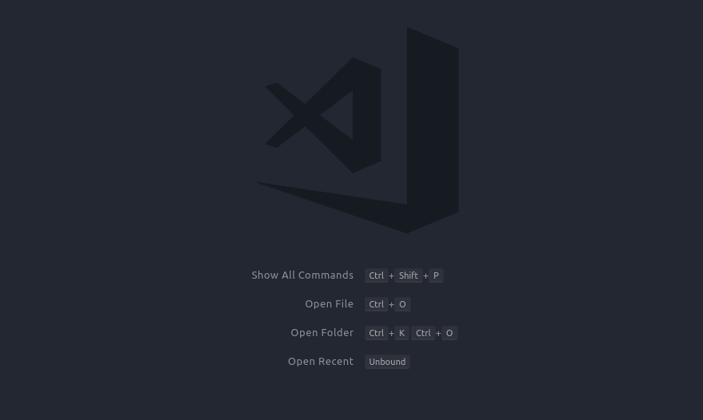

VSCode - Terminal Capture
=================================================

As a vim user, one of the features that I truly enjoy is the integrated
terminal and the ability to switch to `Terminal-Normal` and quickly scroll
through the output of my terminal. As such I wanted a quick and easy way
to do something simliar in vscode (including using vi keys to navigate/interact
with the terminal).  

The first thing that I tried was using tmux in the terminal and start it by
default when in a vscode environment.  While this worked, I didn't like the
flow quite as much.  So I decided to try my hand at writing a vscode extension.  

## Features

Take the output from the last active terminal and dump it into a new file.  

  

There are currently two modes that the extension can run in.  

1. clipboard mode
2. caching mode (**alpha** mode)

When using clipboard mode, the extension functions just like a macro where it
quickly runs the following vscode commands.  

* `workbench.action.terminal.selectAll`
* `workbench.action.terminal.copySelection`
* `workbench.action.terminal.clearSelection`
* `workbench.action.files.newUntitledFile`
* `editor.action.clipboardPasteAction`

The caching mode system will track all data entered into the terminal (including
keypresses like backspace) and display all the captured content.  Right now this
means that it will display all the special characters including `\b` and `\r`, etc.
This is nice in that it can capture more of the history of how the terminal was run,
however it will also use more memory as it is caching the output for the life of
the terminal.  

### Adding a Keybinding

By default, this extension does not introduce a keybinding as we don't want
to introduce a conflict or other confusion to your workflow.   It you would
like to setup this command to a keybinding, here is an example of the json
you can enter in the `keybindings.json` file.  

    {
      "key": "ctrl+t c",
      "command": "extension.terminalCapture.runCapture",
      "when": "terminalFocus"
    }

## Extension Settings

This extension has a couple of settings depending on the type of usage you would
like to have.  

* `terminalCapture.enable`: enable/disable this extension  
* `terminalCapture.useClipboard`: use/disable clipboard copy mode  

This extension has a single command.  

* **Terminal: Capture Output** - `extension.terminalCapture.runCapture`  

## Known Issues

At this time, it is known that the caching mode will include style characters
in the output. This is to be fixed soon.  

### 0.1.0

For this version, this is the initial release that supports using the clipboard to
copy content from the terminal to an unamed file.  

The cache mode is partially supported, but does not handle all special characters
correctly.  This is currently not the recommended mode.  
